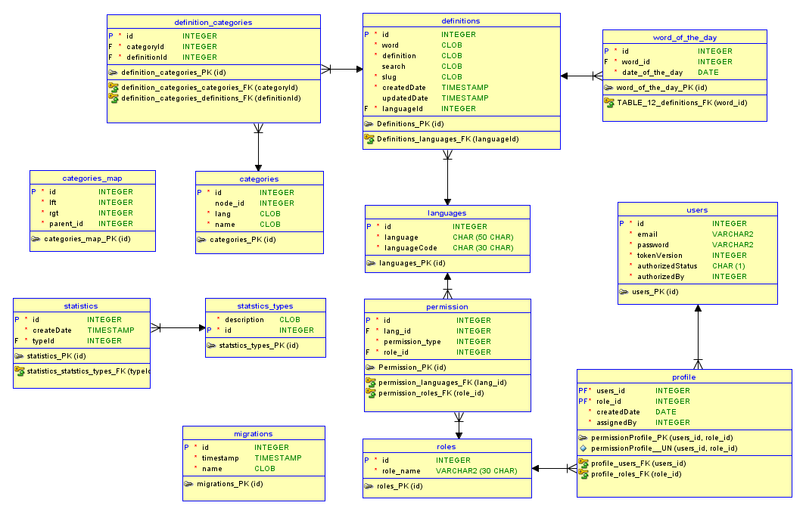

## Database

Credit @irisctl

Latest: July 5th, 2020

Note: We are optimizing the word of the day, and adding role support in a coming release.
Note: Still some types to fix in the diagram. The CLOB's for example are mostly postgrest TEXT columns, but the idea is here.

----