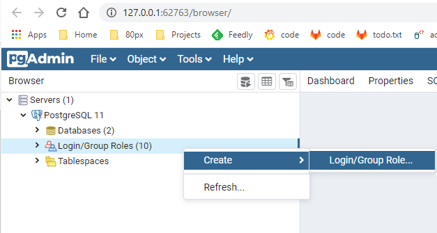
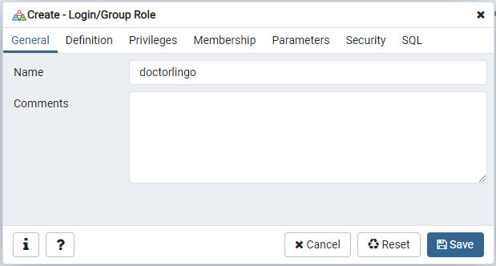
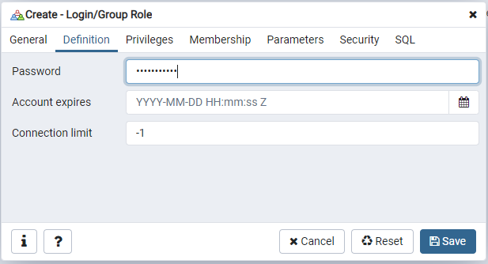
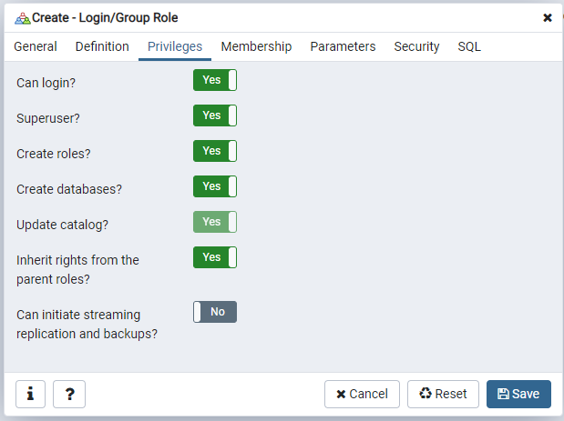
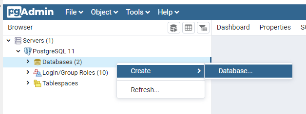
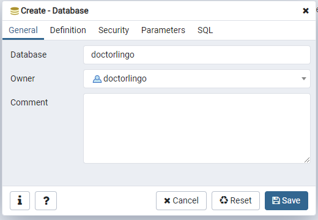

## Development

This is how we get set up for the API to do local development.

First you have to have a postgres database running, then you start the API project.

----
### Start a local postgres 12 database

#### Windows

Download postgres 12: https://www.enterprisedb.com/downloads/postgres-postgresql-downloads

- Install default everything
- We don't need Stack Builder
- Once it's done, move onto the "Add the doctorlingo database and user" section

#### Mac

Download postgres.app: https://postgresapp.com/downloads.html

- Download the one that has postgres 10 11 and 12 under "Additional Releases"
- Add it to your Applications folder, start it up whenever you want the project to start

Once you start postgres.app the first time it begins with a default Postgres 12 database.

- Once you have a running Postgres 12 database, move onto the "Add the doctorlingo database and user" section

----

#### Add the doctorlingo database and user

Once you have postgres running either through the windows installer (started as a service), or by starting postgres.app on mac, we need an interface for viewing the data.

This project recommends using pgAdmin, which is a web application that connects to postgres for running queries, seeing statistics, etc.

Windows:
- Just open up pgAdmin, it came with the install.

Mac: 
- Download the latest pgAdmin for mac: https://www.pgadmin.org/download/pgadmin-4-macos/
- Open and copy pgAdmin 4.app to your Applications folder
- Open up pgAdmin 4.app

**It may ask to set a default password. I recommend using `postgres`. The password may be `postgres` by default also.**

1. Add the doctorlingo user
- Right click the Login/Group Roles item, and create a new Login/Group Role

- Make the name `doctorlingo`

- Make the password `doctorlingo`

- Set the permissions for the doctorlingo user

Great! Now add the doctorlingo database and make this user the owner.

2. Add the doctorlingo database

- Right click Databases and create a new database in pgAdmin

- Make the database name `doctorlingo` and the user `doctorlingo` from step 1

Save and you're ready to move on to "Start the API Project" section! Almost there, I promise :)

#### Sidenote: 
If you are comfortable using another tool like Azure Data Studio, please feel free. Here's the SQL commands we're ultimately running:

`CREATE ROLE doctorlingo LOGIN SUPERUSER PASSWORD 'doctorlingo';`

`CREATE DATABASE doctorlingo OWNER = doctorlingo;`

----

### Start the API Project

1. First thing to do is make sure your `code.doctorlingo.com` account has your SSH key for access through git. Here's some documentation on how to create an SSH key, and add it to your account:
    - https://code.doctorlingo.com/help/ssh/README#generating-a-new-ssh-key-pair
2. Make sure you have the necessary programs
    - NodeJS: https://nodejs.org/en/download/
    - Yarn: After installing NodeJS, open a terminal and run `npm install -g yarn`
3. Clone the repository to a known location, and go into the folder
    - `cd /users/mark/code/doctorlingo`
    - `git clone git@code.doctorlingo.com:doctorlingo/api.doctorlingo.com.git`
    - `cd api.doctorlingo.com`
4. Install the project
    - `yarn install`
5. Copy the environment variable example file `.env.example` to `.env`.
    - `cp .env.example .env`
    - If you look at the file, it uses the settings from setting up postgres above
5. Start the project to initialize the tables in the database
    - `yarn start`
6. Stop that process when it is finished
7. Use the following command to run migrations on the database to insert data
    - `yarn dev`
    - You can use this command from now on whenever starting the API project.
    - Make sure to start the database if it is not running as a service!

That's it! With the API running and connected to our local database, we can now move forward to the [the website development wiki page](https://code.doctorlingo.com/doctorlingo/doctorlingo.com/-/wikis/Development).

Please also view our [Developer Flow](https://docs.google.com/presentation/d/101-nxl0kIHe65SANeXf-Ub-5C54Hwiz3084Z8bfi0PI/edit#slide=id.p)