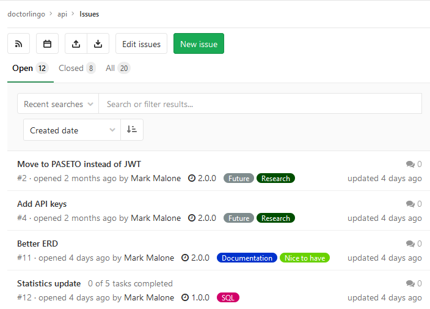
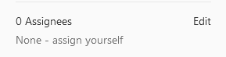
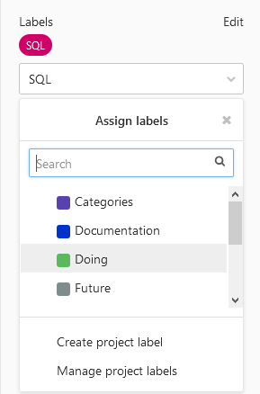
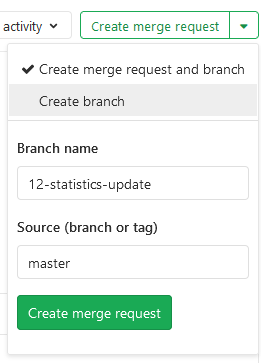
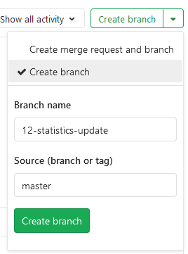
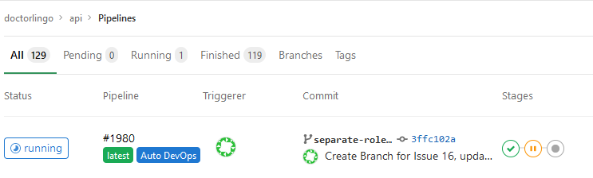
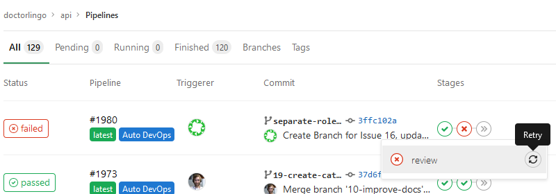
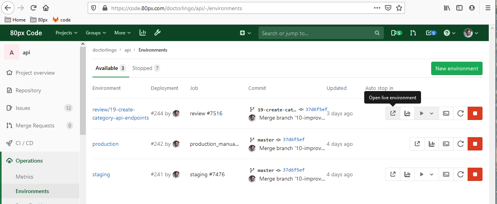
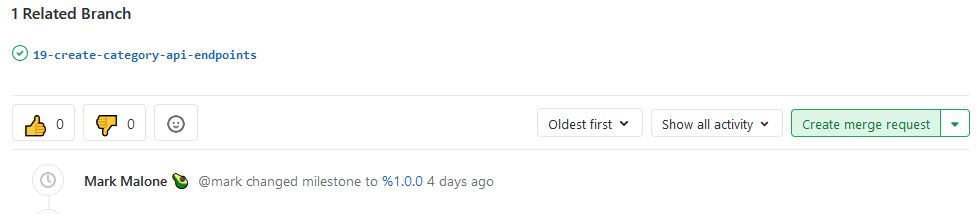

## How to contribute

This is a document aimed at helping people understand how to contribute changes to the `api` project specifically.

The project uses Issues as the form of tracking changes. Issues are the glue for everything in the CI/CD pipeline, so please stick to this style for changes.

Issues page: https://code.doctorlingo.com/doctorlingo/api.doctorlingo.com/-/issues

----

### Steps for contributing
1. [Find an issue](#1-find-an-issue)
2. [Create a branch](#2-create-a-branch)
3. [Review database creation](#3-review-database-creation)
4. [Push code](#4-push-code)
5. [Create merge request](#5-create-merge-request)

----

#### 1. Find an issue

Open the issues page and find something you want to work on.

Once you find an item, go to the page.

- Assign yourself

- Give it the `Doing` label to help us know it's been taken

----

#### 2. Create a branch

Inside the issue still, click `Create merge request` and change it to `Create branch`

Then click `Create branch`

----

#### 3. Review database creation

When you create a branch, you are also creating a new environment. You can see the build jobs start to happen for your branch to create your new environment under the `CI/CD` button on the left.

The API is set to use a database based on it's environment.

We have `doctorlingo_staging` and `doctorlingo_production` for https://staging.api.doctorlingo.com/ and https://api.doctorlingo.com respectively.

----

#### 4. Push code

Once your review database has been made, go to the `CI/CD` pipeline and retry the deploy step for the environment.

A new job will be kicked off every time you commit code to the branch. (Try to only have one job running at a time, please)

Once the first build and deploy jobs complete, you will have a review URL you can use to test things before making a merge request.

Go to `Operations > Environments` to get the URL:

It will be something like: https://**56-review-19-create-1bhnv2**.k8s.doctorlingo.com/

----

#### 5. Create merge request

After you have pushed your code changes to the branch and are ready for this change to go live, you can request a merge request.

On the issues page, hit the `Create merge request` button.

This will now flag the people who can approve it.

After it is approved, it will move to staging for a final review, then to production manually.

----
